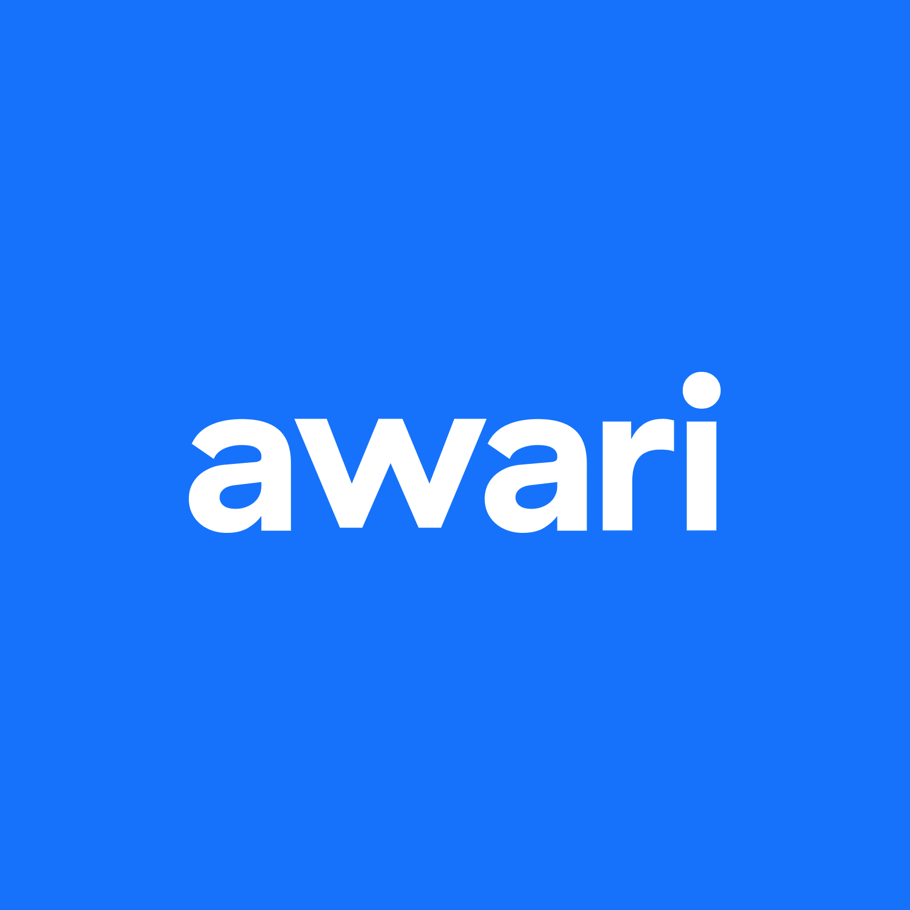

## Diploma, Courses and certificates
- Full Stack Web Developer Certificated by Awari School 2022.
- Drawing Graduation (Art education Licentiate) at EMBAP-Brazil 2010.
- Graphic and Product Design Certificated by ENSITEC 2006.
 
## What I do already know:  
- Create Responsive web sites and applications whit HTML, CSS and JavaScript.
- Build Nextjs and Reactjs applications.
- Access REST API with fetching, Axios and SWR.
- Deploy, Commit, Pullrequest, Merge on Git, Github, Gitlab, Bitbucket, Heroku, Vercel.
- Data Base: Select, Create, Read, Update and Delete.
- Use supersets like SCSS and TypeScript
- To talk in public teaching adults, teenagers and childrens.
- Develop images, animations, paintings using perspective, human proportion, light and shadow and realistic textures.
- Create digital paintings and vector drawings with Photoshopp and Illustrator.
- Reverse engeneering on any audio visual production.

## Full Stack Abilities:  
 
|FrontEND Technologies         |       |BackEND principles        |
| :--------------------------- | ----- | :----------------------- |
|⭐SASS SCSS                   |       |⭐SQL, Sequelize, Postgres |
|⭐JavaScript                  |       |⭐Dbeaver                  |
|⭐Nextjs                      |       |⭐SCRUD                    |
|⭐Reactjs                     |NODE   |⭐TypeScript               |
|⭐HTML5                       |GIT    |⭐APACHE                   |
|⭐Bootstrap                   |Github |⭐Cloud                    |
|⭐Chakra, MUI, Fontawesome    |       |⭐Security                 |
|⭐SEO                         |       |⭐AWS                      |
|⭐JQuery                      |       |⭐API REST                 | 
  
## SOFTWARES I do use on my projects:

| Web Dev | Design+Art | Audio       |
| ------- | ---------- | ----------- |
| VS code | Photoshopp | Ableton Live|
| Figma   | Illustrator| Nuendo      |
| Adobe XD| Premiere   | Fruit Loops |
| GIT     |            |             |
| Dbeaver |            |             |
| Node    |            |             |

- I can work both on Windows and Linux(and WLS).   

 
  

          
   
  
    

   
   

  

### Links to Other Projects by Ulisses Malanski  
 
- <a href="https://malanski.github.io/cron/" title="Cronometer" target="_blank">Cron</a>  
- <a href="https://poke-store-next.vercel.app//" title="Nextjs Ecommerce Pokemon Store" target="_blank">Poké-Store Next Js</a>
- <a href="https://malanski.github.io/pokestore-react/" title="Reactjs Ecommerce Pokemon Store" target="_blank">PokéStore React Js</a>  
- <a href="https://malanski.github.io/GessingColorGame/" title="Color Game JavaScript CSS HTML" target="_blank">Gessing Color Game</a>
- <a href="https://malanski.github.io/projeto-react-app2/" title="Artistic Portfolium" target="_blank">Portfolium React App</a>
- <a href="https://malanski.github.io/CalculatorX/" title="JavaScript study Calculator">Calculator</a>  
- <a href="https://malanski.github.io/pokeLoja2/" title="My Firts Vanilla Ecommerce project">Vanilla Ecommerce Poke Card Game Styled</a>
- <a href="https://malanski.github.io/awari-ulisses-dev/" title="Awari Course Activity">Web Development Course Activities</a>  
- <a href="https://malanski.github.io/MyResume/" title="A short personal Resume">My Resume</a>  

            
